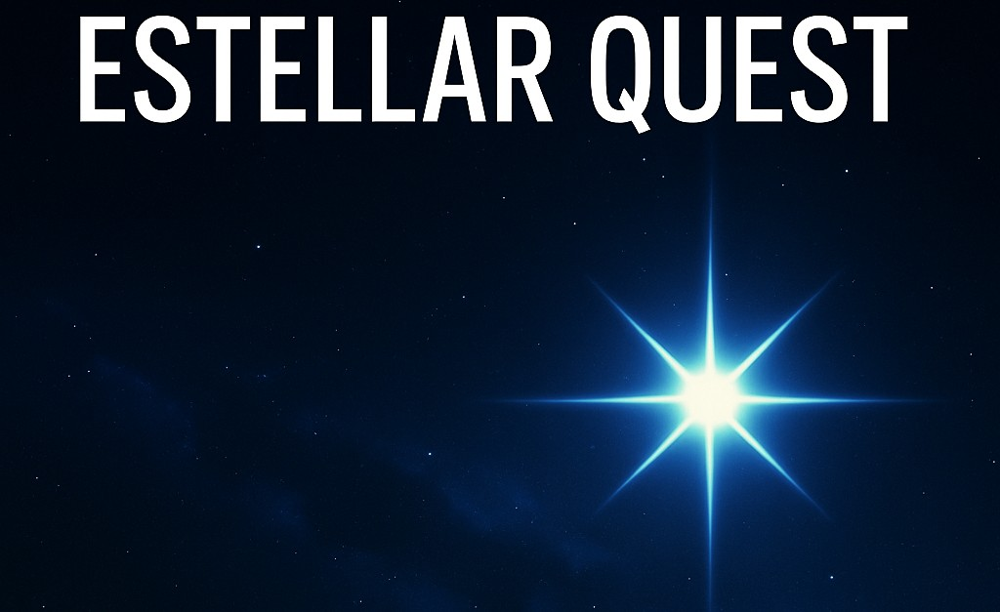
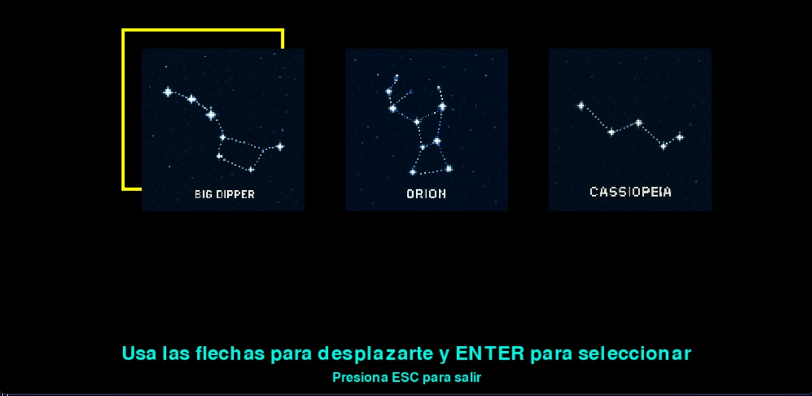
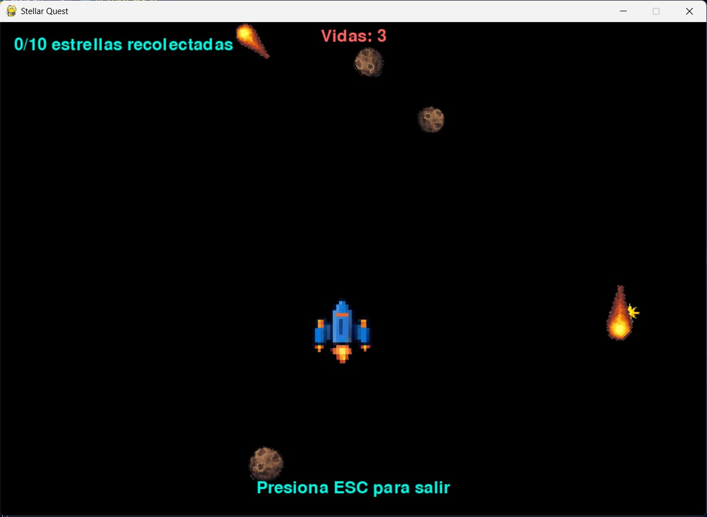

# Estellar Quest



## Descripción
**Estellar Quest** es un videojuego interactivo desarrollado en **Python** utilizando la biblioteca **Pygame**. Este proyecto combina mecánicas desafiantes, personalización de experiencia y una atmósfera espacial inmersiva, orientado a proporcionar tanto entretenimiento como aprendizaje en desarrollo de videojuegos.

## Características
- **Menú de Inicio**:
  - Tutorial
  - Iniciar Juego
  - Configuraciones
  - Salir


- **Personalización**:
  - Elección entre dos temas visuales.
  - Selección de skins para el jugador.



- **Selección de Niveles Dinámica**:
  - Progreso basado en niveles desbloqueables.

- **Jugabilidad**:
  - Movimiento en 4 direcciones.
  - Sprint temporal que inhabilita colisiones.
  - Recolección de estrellas y esquiva de obstáculos como asteroides y meteoritos.



- **Música de Ambiente**:
  - Banda sonora inmersiva con control de volumen.

## Requerimientos del Sistema
- **Sistema Operativo**: Windows, macOS o Linux.
- **Python**: Versión 3.10 o superior.
- **Bibliotecas**:
  - `pygame`


## Contribuciones
Las contribuciones son bienvenidas. Para contribuir:
1. Haz un fork del repositorio.
2. Crea una rama para tu función:
   ```bash
   git checkout -b nueva-funcion
   ```
3. Realiza los cambios y haz un commit:
   ```bash
   git commit -m "Agregada nueva función"
   ```
4. Envía un pull request.


## Contacto
Para preguntas o sugerencias, puedes contactarme en:
- **Email**: diegolopsed160703@gmail.com
- **GitHub**: [DiegoLopSed](https://github.com/DiegoLopSed)

---

¡Gracias por jugar **Estellar Quest**! 🚀
